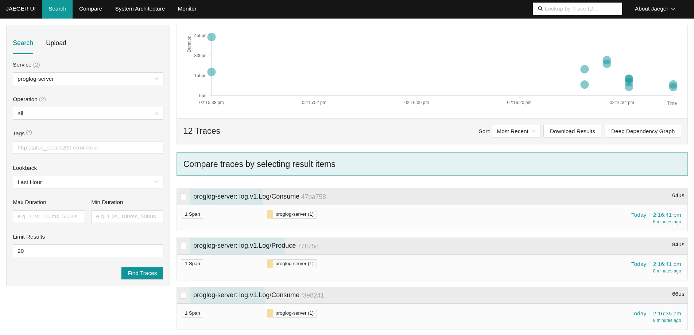

running a jaegar container:
docker run --name jaeger   -e COLLECTOR_OTLP_ENABLED=true   -p 16686:16686   -p 4317:4317   jaegertracing/all-in-one:lateste

This contains the best explanation of opentelemetry I've encountered
https://www.romaglushko.com/blog/opentelemetry-sdk/

# running docker locally

~/my_repos/proglogs/proglog/just-docker-test

running docker container:

docker run --rm -it   -v $(pwd)/config.yaml:/var/run/proglog/config.yaml   -p 8400:8400   -p 8401:8401   github.com/alebranching/proglog:debug   --config-file=/var/run/proglog/config.yaml

## exporting traces to jaeger
